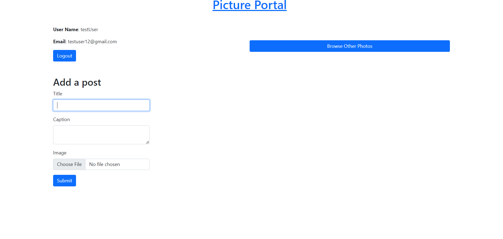
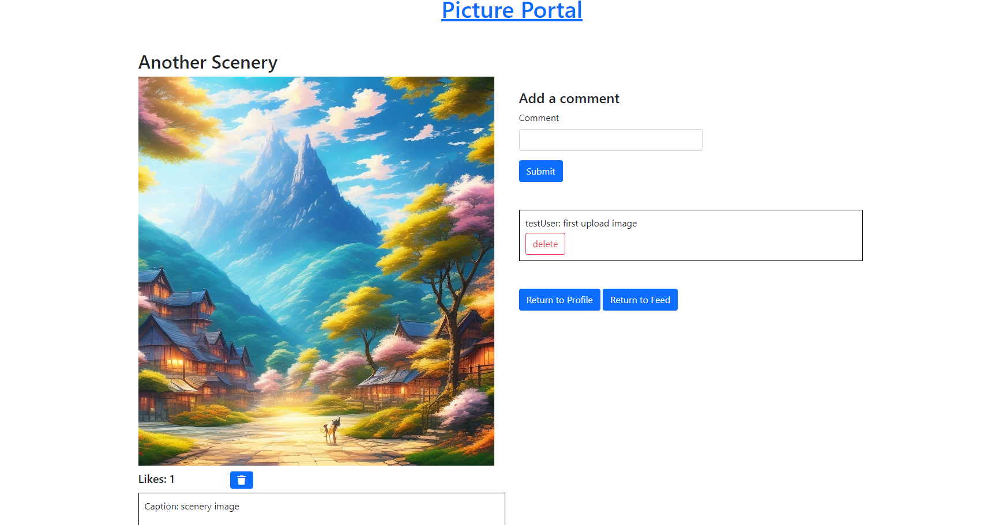

VsCode Setup:
```plaintext
git clone https://github.com/KonnyGuo/social_platform.git or download as zip
```
Make sure you have a mongoDB atlas account. Inside configs folder. Create new file called .env and set MONGO_URI = <yourMongoDBConnection> (you need to set this up with your Mongo altas cluster connection).<br>

Make sure to make a cloudinary account and grab the CLOUD_NAME = yourCloudName, API_KEY = yourCloudinary_API_KEY, and API_SECRET = yourCloudinary_API_SECRET and store it inside the env file.

To run the app. In the same directory run these two commands below. npm install to install all the packages and npm start to start the app.
```plaintext
npm install
npm start
```

Summary: A social media app for posting, viewing, and liking images for multiple users. Below are examples of the landing page, creating and commenting images, and browsing images posted by others after creating an account and logging in.

Users can
- create/delete post
- create/delete comments
- like post (1 like per post)
- view post that others users had made <br>

Users cannot
- Delete other Users post or comments <br>

 <br>


= <br>


