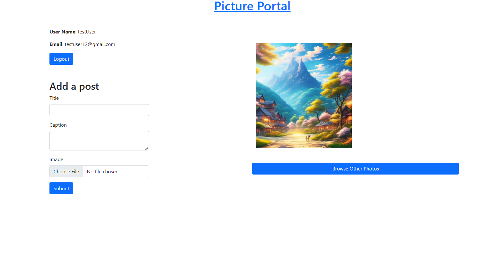

link: https://pictureportal.onrender.com/

Summary: A social media app for posting, viewing, and liking images for multiple users. Below are examples of the landing page, creating and commenting images, and browsing images posted by others.
Users can
- create/delete post
- create/delete comments
- like post (1 like per post)
- view post that others users had made
Users cannot
- Delete other Users post or comments

=

